# README

## Introduction

A site to plan races with friends.

Plan the running races you want to do, either marking yourself as interested or going. Set targets and record how you did. Add friends and sign up to races with them. Manage your profile, restricting access to personal details and making the experience nicer.


## Getting started

The settings are currently pointing to the dev.py. In the dev environment emails are sent to the console. The production environment was setup originally to deploy to Heroku but needs re-testing. The production environment also requires environment variables.

We are using a Postgres database, once this is installed run:
```
python manage.py migrate
python manage.py runserver
```

The emails are queued using Redis:
https://redis.io/docs/latest/operate/oss_and_stack/install/archive/install-redis/

The queue requires us to start a worker for email:
```
python manage.py rqworker email
```

Insert some distances for the dropdown:
```
insert into main_distance (description) values ('10k');
insert into main_distance (description) values ('10 Mile');
insert into main_distance (description) values ('Half Marathon');
insert into main_distance (description) values ('Marathon');
```

## The pages

### Create an account and login

*Create an account*
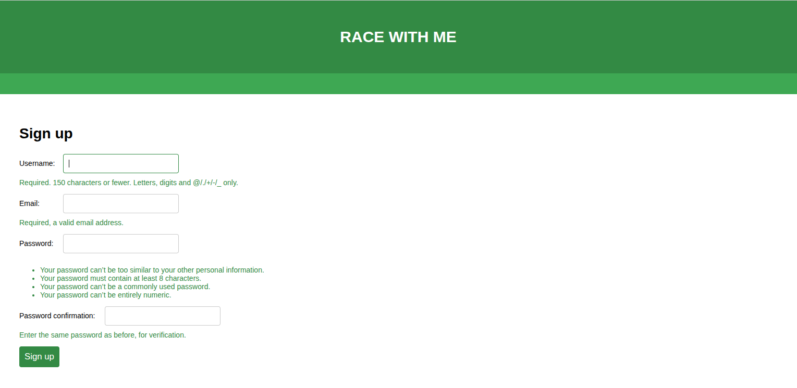

Once you have created an account (note registration confirmation email sent to console in dev environment) you can login.

*Login screen*
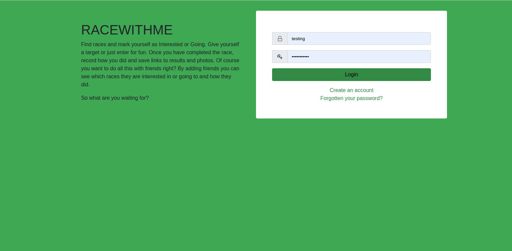

### User menu

*User menu*
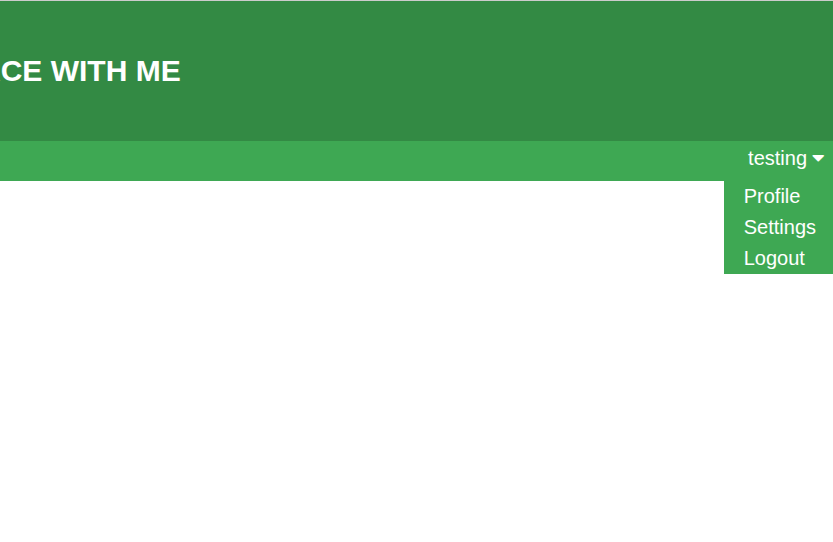

*User profile*
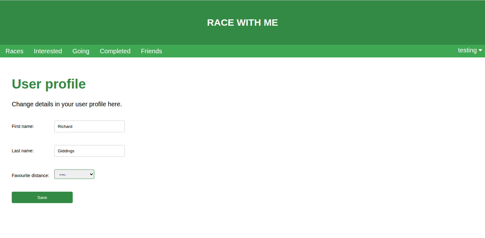

Here you can set your favourite distance.

*User settings*
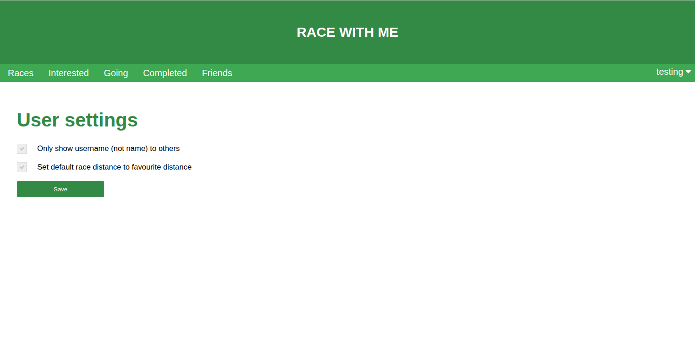

A privacy setting and whether to default the distance dropdowns to your favourite distance.

### Races

*Races*
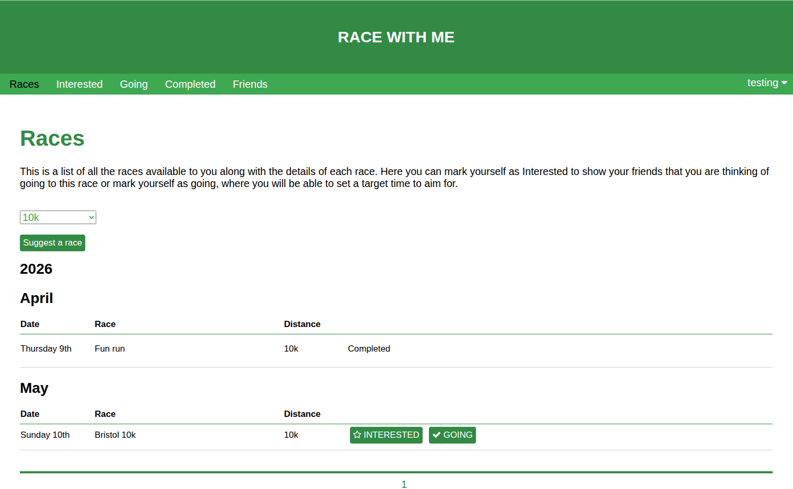

Here you can:
- See the available races, filter by distance and suggest a new race.
- Mark as being interested in or going to a race. This moves the race to the appropriate tab.

*Suggest Races*
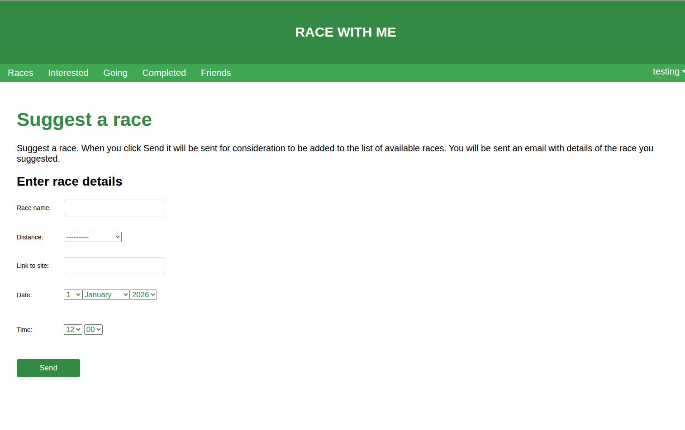

Suggestions are emailed (sent to console in dev environment) to be added.

### Interested

*Interested*
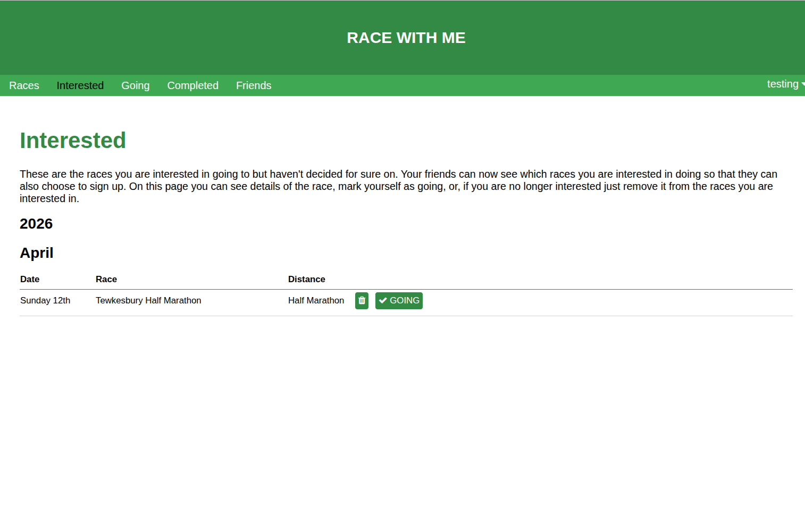

Here you can either mark yourself as no longer interested (moves back to Races tab) or mark yourself as going.

### Going

*Going*
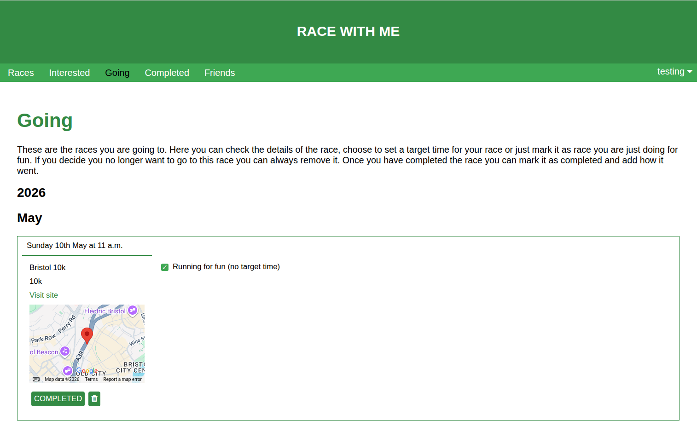
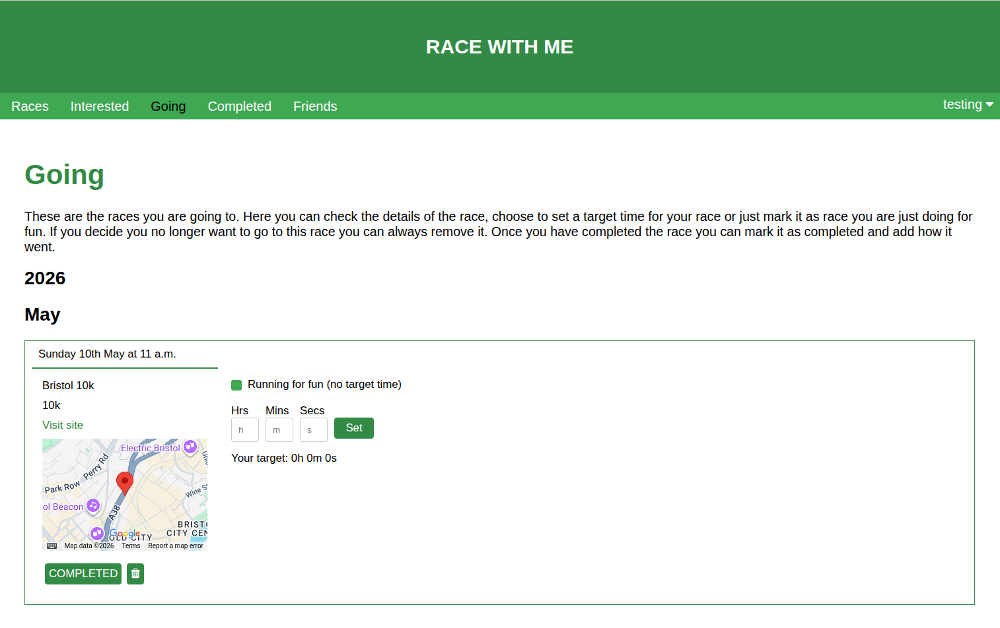

Shows the races you are going to. You can either choose to run for fun or set a target time.

### Completed

*Completed*
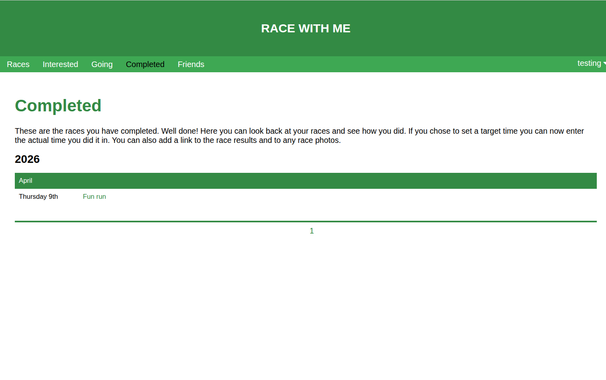

Shows the races you have completed. Clicking on the name shows more details such as your time, whether any friends went e.t.c.

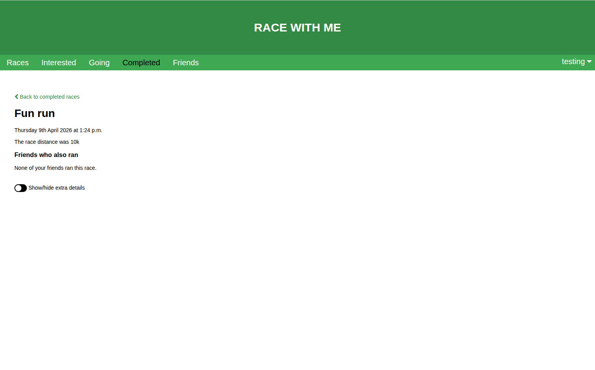
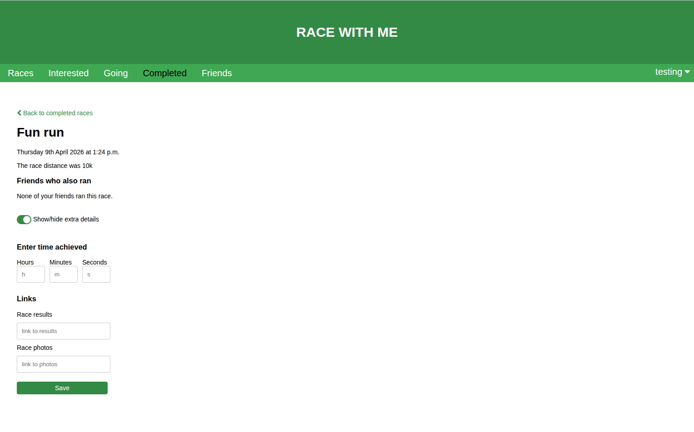

### Friends

*Friends*
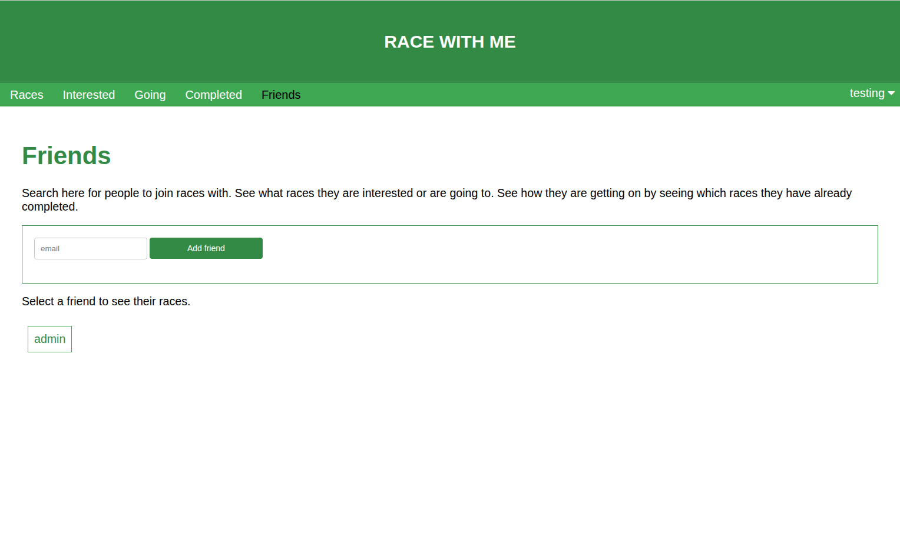

Here you can add friends to see what they have entered (need their email address).

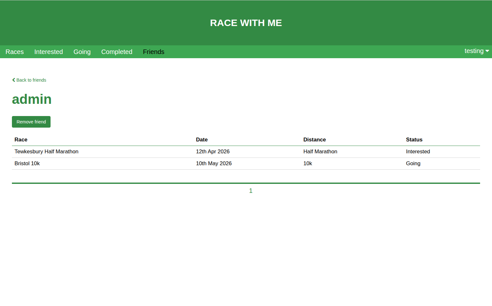

Here you also have the option to remove the friend.